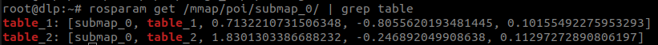

# Dockers

This repository contains one docker image named `registry.gitlab.com/competitions4/sciroc/dockers/sciroc`

## What is a docker?

Docker is a platform for developers and sysadmins to develop, deploy, and run applications with containers. The use of Linux containers to deploy applications is called containerization. Containers are not new, but their use for easily deploying applications is.

Containerization is increasingly popular because containers are:

- Flexible: Even the most complex applications can be containerized.
- Lightweight: Containers leverage and share the host kernel.
- Interchangeable: You can deploy updates and upgrades on-the-fly.
- Portable: You can build locally, deploy to the cloud, and run anywhere.
- Scalable: You can increase and automatically distribute container replicas.
- Stackable: You can stack services vertically and on-the-fly.

If you are interested on how docker works, visit her [webpage](https://docs.docker.com/)

## Where is the docker image located?

On gitlab.com, your image should be inside the *Container Registry* of this project. This is accessible on the left sidebar, under the *Packages & Registries* entry.

You can use the **copy** button to retrieve the url for using it, it will be needed later instead of PATH\_TO\_YOUR\_DOCKER\_IMAGE

## Run the docker

In order to start the docker loaded on this repository, you will need to log in the docker daemon on gitlab.com:

```
$ docker login registry.gitlab.com
```
an then enter your personal GitLab user and password.

For your convenience, we have published some scripts that simplify the launch of a docker with GPU acceleration. Follow the instructions at [pal_docker_utils](https://github.com/pal-robotics/pal_docker_utils/) to properly set up your environment with nvidia-docker. If you do not follow the steps properly, you will not be able to run gazebo, rviz or other graphical applications from within the docker container.

Once logged and after configuring pal\_docker\_utils, you will need to execute the [pal_docker.sh](https://github.com/pal-robotics/pal_docker_utils/blob/master/scripts/pal_docker.sh) script with the name of the image and the application you want to start.
```
$ ./pal_docker.sh -it -v /dev/snd:/dev/snd PATH_TO_YOUR_DOCKER_IMAGE
```
The previous command starts a bash terminal inside a container of the specified image.

Example for this repo:
```
./pal_docker.sh -it -v /dev/snd:/dev/snd registry.gitlab.com/competitions4/sciroc/dockers/sciroc
```

**Attention!** Remember that once inside the docker, any file created or any program installed on the docker will be deleted, if the specific file was not saved on the exchange folder. If the user needs to install a speicifc software everytime, it is better to create a new docker following the instructions on the [tutorials](https://docs.docker.com/get-started/), and taking as a base the desired docker.
 image.

---

# Start the simulation
```bash
source /opt/pal/ferrum/setup.bash
roslaunch tiago_998_gazebo tiago_navigation.launch
```
## Built in functionalities
### Navigation
List current points of interest (POIs):
```bash
rosparam get /mmap/poi/submap_0/ | grep table
```


Now we can simply go to the desired poi using the `go_to_poi` action specifying the name
```bash
rostopic pub /poi_navigation_server/go_to_poi/goal pal_navigation_msgs/GoToPOIActionGoal "header:
  seq: 0
  stamp:
    secs: 0
    nsecs: 0
  frame_id: ''
goal_id:
  stamp:
    secs: 0
    nsecs: 0
  id: ''
goal:
  poi:
    data: 'table_1'" 
```
### Simulate rbg and microphone from your hardware pc
To ensure that the docker has access to your hardware you can use the following command to test it.

```bash
arecord -l
# take note of card and device number to put instead of hw:0,0
# record some noise
arecord -f cd -d 5 -D hw:0,0 /tmp/micro.wav
# check if you can reproduce it
aplay /tmp/micro.wav
```

When you run the simulation, you will be able access the camera of your pc if it has been properly configured:
Camera:
launch manually the default values:
`rosed usb_cam usb_cam-test.launch`

```bash
rostopic echo /usb_cam/image_raw
```
Microphone:
launche manually:
`roslaunch audio_capture capture.launch`
```bash
rostopic echo /audio/audio
```

In order to modify the parameters of previours packages:
`rosed tiago_998_gazebo sciroc_extras.launch`


---

# Create a docker image with your packages and configurations
In this competition user should only provide a single docker image that should work out of the box with everything compiled, installed and sourced.
In order to achieve this and specially if you are not very experienced with dockers we are going to provide some tips.

## Create a docker image with your **compiled** packages
In this repository you can find the `Dockerfile`. There you have to add the commands to:
  1) Install debians (e.g. ros-melodic-<pkg_name>)
  2) Add your new/modified ros packages

After that you need to build the image:
```bash
docker build -t <your-name> .
```

Save the image:
```bash
docker save -o <output_full_path> <docker_image_tag>
```
We strongly suggest that you first test it in another machine to ensure everything works out of the box.
Load the previous image:
```bash
docker load < <docker_image_name>.tar.gz
docker images # check it is
```

Finally send to tiago-support@pal-robotics.com the docker image. Ensure it will work out of the box using [run a docker](#Run-a-docker) replacing `PATH_TO_YOUR_DOCKER_IMAGE` for your docker image.


